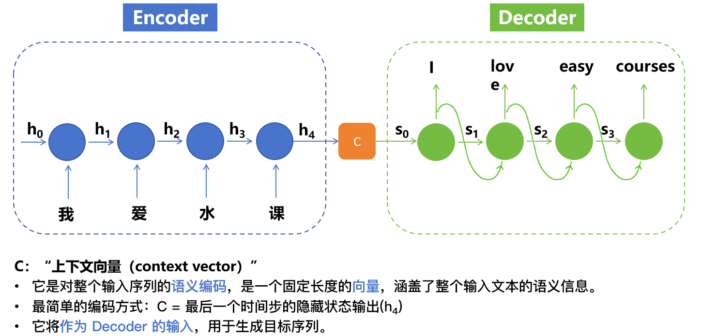
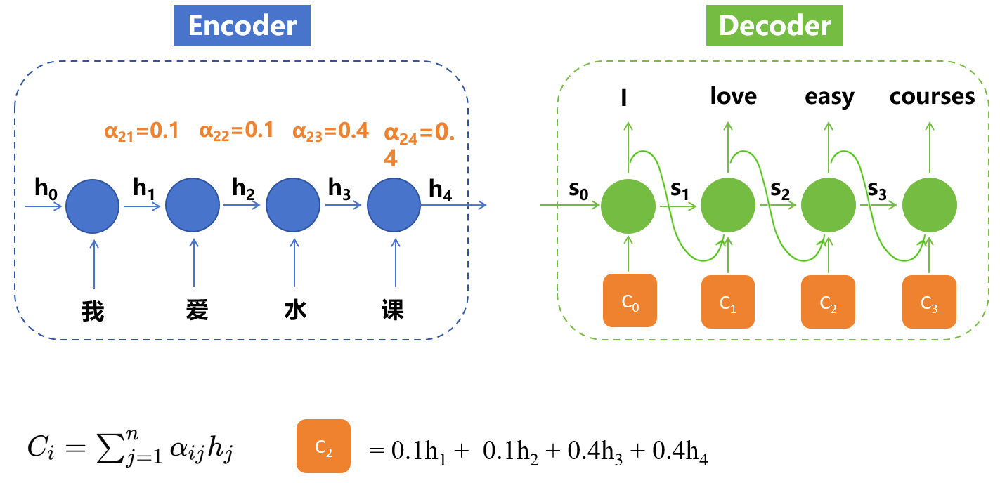
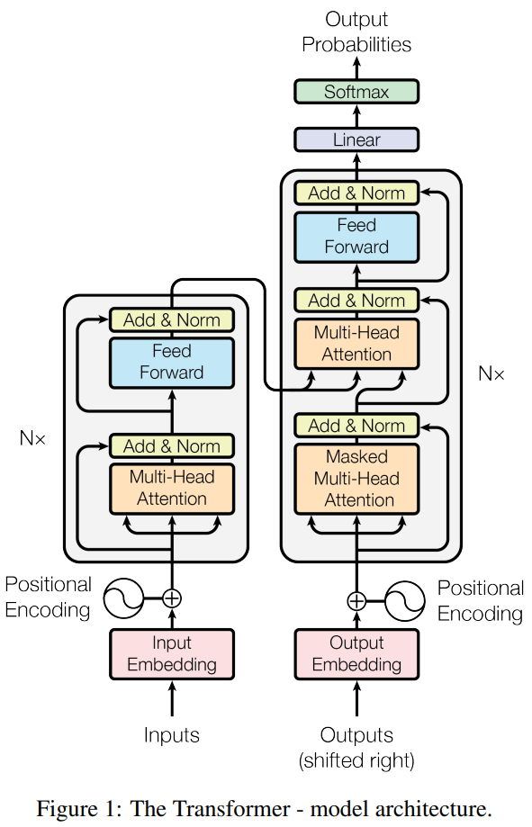

# Transformer

- [Transformer](#transformer)
  - [Intro](#intro)
  - [整体设计思想](#整体设计思想)
  - [Model architecture](#model-architecture)
    - [Encoder](#encoder)
    - [Decoder](#decoder)
    - [输出层](#输出层)
  - [补充](#补充)

> * Reference:
> * [论文解读及Transformer架构详细介绍视频](https://www.bilibili.com/video/BV1xoJwzDESD/?share_source=copy_web&vd_source=b576499af9e9962cb710c58072253ab6)
> * [Paper: Attention Is All You Need](https://arxiv.org/abs/1706.03762)

## Intro

> 强推[视频讲解](https://www.bilibili.com/video/BV1xoJwzDESD?t=125.8)，以下仅为文字概述

* **序列转导模型Sequence Transduction Model**：将一个序列转换成另一个序列的模型
  * 序列数据：具有顺序关系的数据，每个**元素的顺序**对于数据的**整体含义**非常重要
  * 序列转导任务：文本翻译，文本摘要，文本生成，语音转文字等
* Transformer之前该任务基于RNN模型完成（小部分FNN/CNN）
* **FNN**/CNN: 输入长度固定，且没有时序信息
* **RNN**: 输入长度可变，且有时序信息
  * 但RNN的问题是：有时候输出和输入是不等长的，比如翻译任务中，中文句子和英文句子长度不一样；此时就需要Encoder-Decoder结构
* **Encoder-Decoder**：
  * Encoder：将输入序列编码成一个固定长度的向量表示（一个Encoder就是一个RNN模型，拿到的最后时刻的隐状态$C$作为该序列的向量表示，因为该时刻的$C$包含了整个input的语义信息，也隐式包含了输入各词的位置信息）
  * Decoder：将该向量表示解码成输出序列（Decoder首先会decode $C$得到第一时间步的输出结果$i$，然后将第一个时间步的隐藏状态$S_1$和 **输出结果$i$** 一起作为下一个时间步的输入
  * 或者还有一个路子：Decoder每个step都再次输出$C$
  *   
  * Encoder-Decoder结构的问题：
    * 远距离 ==**遗忘**== 问题：$C$受到靠后step的影响更大，靠前的信息可能已经遗忘的差不多了
    * 所有时间步的输入都被压缩到一个上下文向量$C$（不同时间步的信息被“平均化”了），**在某个时刻$t$生成输出时，输入序列中各位置的重要性其实不一样**；一般来说，离$t$更近或语义更相关的输入更重要；但原始Encoder–Decoder没有机制去区分这些输入的差异，它只能一股脑地用$C$里的“平均信息”
      * 比如：在翻译某个词时，有些输入词更关键（例如要翻译“苹果”时，输入的“apple”最重要，别的就不那么相关）。
    * 此时就需要attention mechanism来解决这俩问题（**注意注意力机制在transformer之前就有啦**，Transformer只是提出了self-attention机制）
* **Attention机制**：在生成输出的某个时刻，Decoder不再只依赖“平均化”的$C$，而是能有选择性地关注输入序列中不同位置的信息（也就是对不同的输入位置的隐藏状态$h_i$乘以不同的权重，如下图：
  *   

---

* 此外，基于RNN结构的模型（不论是否含有Encoder-Decoder， attention mechanism）还有第二个致命缺陷：==**无法并行化计算**==
* **RNN的计算是顺序的**，即$t$时刻的计算必须依赖$t-1$时刻的结果（不论是encode还是decode阶段），这就限制了模型的并行能力（不能同时计算多个时间步）

第一个致命缺陷是上文所述**远距离遗忘问题**：

* 顺序计算的过程中信息会丢失，尽管LSTM等门机制的结构一定程度上缓解了长期依赖的问题，但是对于**特别长期的依赖现象**，LSTM依旧无能为力

> 长期依赖现象：RNN经过许多阶段传播后的梯度倾向于消失(大部分情况)或爆炸(很少，但对优化过程影响很大)。使得神经网络的优化变得困难。网络丧失了学习很久之前信息的能力。

## 整体设计思想

> [视频讲解](https://www.bilibili.com/video/BV1xoJwzDESD?t=1142.2)

* 上文讲了RNN是串行计算的，比如encoder中，编码第$t$个词时，必须等到$t-1$个词编码完毕才能进行；decoder中同样，想要decode第$t$个词时，也必须等到前面所有词都decode完毕才能进行...
* 但是我们在**训练的时候**，**其实是知道答案**(Ground Truth)的，对于翻译任务，我们上来就知道“我爱水课”翻译成“i love easy courses”，所以**根本没必要等待呀**！（RNN的话就是要强迫你等待）
* 具体而言，**训练中**，编码和解码不同于上述RNN中。**编码时**，每个词首先被转为一个向量，我们在编码第$t$个词时，**是可以看到整个上下文中其他所有词的信息的**，将这些信息都encode到第$t$个词的vector中去。同理，对于$n$个token我们都这么干，且是**同时**这么干！
* 然后你可能注意到这里不像RNN一样串行天然具有时序位置信息，所以我们**需要额外加一个vector**，也即后文positional encoding。这样我们就得到一个**注意力矩阵**
* **解码器**类似，有一点不同，解码第$t$个词时，我让他看到前面所有的token，**把后面的token遮住(mask)**。意在让他根据前文来预测下一个词。同样是并行地对每一个位置的token同时这么干！

* 注意**推理**的时候，你可没有这个“答案”，你必须要**按顺序/自回归**地去生成结果

> 某种意义上，可以认为Transformer相比RNN是 **“空间换时间”**。在时间上，RNN依赖逐步计算，而Transformer通过自注意力实现了并行计算（虽然理论时间复杂度从 \(O(n)\) 变为 \(O(n^2)\)，但计算量和实际并行执行时间是两件事情）；在空间上，RNN只需存储每步的隐藏状态 \(O(n)\)，而Transformer需要存储整个注意力矩阵 \(O(n^2)\)（其中 \(n\) 为序列长度）。

## Model architecture

训练的时候，假设训练集中有"我爱水课"(作为inputs输入) -> "i love easy courses"(作为outputs输入) 这对句子，那么整个流程如下：

> 注意：严格来说，训练的时候，encoder input是“我爱水课”；decoder input是“`<start>` i love easy courses”(在目标句首加起始符`<start>`，使得目标句子右移一位/**shifted right**)；decoder output/target/训练目标是“i love easy courses `<end>`”

### Encoder

<!-- **Encoder:** -->

1. input embedding将“我爱水课”的每个词/token转换为机器可以理解的embedding vector（e.g., 每个vector是512维度）
   1. 值得注意的是：现在一般llm中embedding model和整个language model是在同一个训练过程中优化得到的
2. 由于vector本身不具备时序位置信息，所以需要显式为其添加positional encoding，PE编码通过公式计算得到(后文详解)，维度和embedding vector相同，将PE直接加到embedding上即可实现将位置信息叠加/贴到语义信息上
3. 然后最重要的是将每一个token的**上下文信息编码**也加到上述vector上
   1. 结构上，encoder的multi-head attention模块内有三个不同的权重矩阵$W_Q, W_K, W_V$（维度是(512, 512)），然后“我爱水课”假设维度是(4, 512)，4个embedding会并行地去**分别**乘以$W_Q, W_K, W_V$，得到**三个分身**$Q, K, V$（维度均为(4, 512)）；这里三个箭头可以理解为$Q, K, V$矩阵，然后进行attention公式计算得到结果（该结果**已经是**叠加了上下文语义信息的输入的embedding结果，依然是(4, 512)）
      1. 注意：权重矩阵$W_Q, W_K, W_V$是在整个模型训练过程中得到的重要参数
   2. 逻辑上，应该注意到**同一个词/token会因为不同的上下文信息编码会有不同的理解/vector**(在原本token的embedding vector上因为上下文编码而发生一定的偏移)，这很合理，比如“我爱水课”中的“水”和“我爱喝水”中的“水”意义就不一样；（参见视频[link](https://www.bilibili.com/video/BV1xoJwzDESD?t=1829.0)）
   3. **那么如何==叠加==上下文的语义信息编码**？答：通过self-attention机制：比如"水"的embedding vector，经过公式$softmax(\dfrac{QK^T}{\sqrt{d_k}})V$，其中Q是“水”的vector，K和V是“我”，“爱”，“水”，“课”的vector（也即Q是当前token对应的query，KV是整个序列）。该公式计算的结果就是“水”在“我爱水课”这个上下文中的语义信息编码（核心思想是：两个向量点积本质上是在计算两个向量的相关性）
   4. 这里$QK^T$其实就是计算了“水”与“我”，“爱”，“水”，“课”的相似性，然后经过softmax得到权重/相似性分数，其实际含义是所有token对当前“水”这个词的语义信息的影响程度。有了影响程度(权重)，和$V$相乘，也就是加权平均了。。。（就是上述经典的attention机制）
4. ok，上述所述为单头注意力机制的完整计算过程，那multi-head attention是什么([link](https://www.bilibili.com/video/BV1xoJwzDESD?t=2106.5))？所谓的多头就是将单头中(512, 512)的$W_Q, W_K, W_V$搞成了8组$W_Q^i, W_K^i, W_V^i$,每个是(512, 64)，这样就得到8个不同的$Q^i, K^i, V^i$ (4, 64)，分别计算8次attention，得到8个结果，然后将8个结果concat起来(4, 512)，然后还要经过一个**线性层**$W_O$将8个结果融合，结果依然是(4, 512)
   1. **为何多头？**/为何将权重矩阵从512降维为8个64？我们想让每一个头关注不同的语义信息，或者说让模型在不同的**语义子空间**并行地学习不同的关系，可以让模型学到更丰富、详细的表示。（单头就只在一个大的混合的语义空间中，只关注一种模式/视角，建模能力有限）
   2. 为何最后加入线性层来重新融合？每个头学到不同特征，线性层整合成统一表示。这个线性层的权重是可学习的
5. 然后经过add(残差连接) & Norm(归一化)层
   1. 残差连接可以保留原始输入的信息，即使后续层学习不到有用特征，也可以保证不会比浅层模型更差
   2. 归一化让数值趋于稳定，方便训练
6. 然后经过feed forward layer，可以对每个位置/token的表示做**非线性变换**，增强特征表达和学习能力。（内部通常有扩张维度，结构维度没变化，得到了encoder最终的输出结果
   1. 注意:$Wx+b$是线性，加上ReLU等激活函数后就引入了非线性

### Decoder

<!-- **Decoder:** -->

1. 答案"i love easy courses"经过output embedding词嵌入
2. 位置编码
3. **masked** multi-head attention
   1. mask意为：解码第$t$个词时，我让他看到前面所有的token，把后面的token遮住（防作弊机制）。让他根据前文来预测下一个词。
   2. 具体实现是，给对应矩阵的上三角部分设置为负无穷，这样经过softmax后，上三角部分的权重就接近0了
4. encoder-decoder multi-head attention
   1. 之前的multi-head attention都是self-attention (即QKV都是自己)，这里是cross-attention (query来自decoder部分的输入(e.g., "i love ..."我现在该生成什么好呢？)，KV来自encoder编码好的结果(e.g., "我爱水课"的编码结果))
5. add & norm
6. feed forward
7. add & norm
   1. 此时已经拿到了decoder的输出结果，维度是(5, 512)。每个向量融合了自己token之前的词的影响（masked self-attention）, 源句子的语义信息（encoder-decoder attention）, 非线性变换后的复杂特征（feed-forward）
   2. 现在还要想办法将vector转换为词/token

---

### 输出层

<!-- **输出层：** -->

1. Linear layer: 该层将(5, 512)的vector映射到词表大小的维度上(假设词表大小是30000)，得到(5, 30000)的结果。每个30000维向量的每个位置的数值是该词的得分（所谓的**logit分数**）
   1. 注意:这个layer就是所谓的**LM-head** / output projection layer
   2. LM-head就是把decoder的输出mapping到次表空间的线性层。有些实现中，LM-head的weights会**共享input embedding层的权重**，以减少参数量，提高稳定性。

$$
logits = decoder_{output} \times W_{LM}^T + b
$$

* $decoder_{output}$: (5, 512)
* $W_{LM}$: (vocab_size, 512)或(512, vocab_size)（取决于实现）
* $logits$: (5, vocab_size)

2. softmax layer: 该层将logit分数映射为概率，30000个数值和为1。即mapping为概率分布。
   1. 然后可以采样或者argmax选择最终生成的token

## 补充

0.Transformer vs. GPT

* 原始Transformer是为机器翻译设计的。机器翻译本质上是条件文本生成，即生成目标语言文本时依赖源语言作为条件
* GPT系列是Decoder-only Transformer，用于无条件或部分条件（prompt）文本生成，不依赖独立的Encoder，直接根据已有文本生成下一步内容

---

1.只有最后一个Encoder的输出给到Decoder，而且是给到所有的decoder，本质上就是把最后一个encoder的K和V矩阵输入到每个Decoder与对应的Q矩阵进行计算

---

2.train的时候是因为我们事先知道样本的全貌，可考虑使用mask机制进行并行操作。test的时候不知道需要预测的下一个词语，故只能串行进行。

---

3.what is attention?

> 背景知识：
> 向量内积表征两个向量之间的夹角，还表征一个向量在另一个向量上的投影$ab=||a||\ ||b||cos\theta$，投影值越大说明两个向量**相关度越高**，如垂直向量之间无关。

注意力函数是一个将一个query和一些key-value对映射成一个输出的函数（query, keys, values, output均为向量），具体来说，**输出output是value的加权求和**，每个value的**权重是这个value对应的key和query的相似度**（compatibility function）计算而得。
> The output is computed as a weighted sum of the values, where the weight assigned to each value is computed by a compatibility function of the query with the corresponding key.

第一步：query 和 key 进行相似度计算，得到权值
第二步：将权值进行归一化，得到直接可用的权重
第三步：将权重和 value 进行加权求和

$$
Attention(Q,K,V) = softmax(\frac{QK^T}{\sqrt{d_k}})V
$$

---

3.why self-attention?

为什么叫Self-Attention呢，**就是一个句子内的单词，互相看其他单词对自己的影响力有多大**

* self-attention layer每层的计算总复杂度更低，低于RNN，CNN
* 计算可以并行化，解决RNN串行计算问题
* 更容易捕捉长距离依赖关系

4.翻译和text generation的区别

* 翻译：有encoder + decoder，decoder会看源句子（cross-attention）生成目标
* 文本生成：只有decoder，靠前文（masked self-attention）一步步生成，不看别的输入
* 核心区别在于是否依赖encoder的输出。二者都要经过Decoder->LM-head->logits->softmax->token

---

更多细节请参考：

* [论文解读及Transformer架构详细介绍视频](https://www.bilibili.com/video/BV1xoJwzDESD/?share_source=copy_web&vd_source=b576499af9e9962cb710c58072253ab6)
* [Paper: Attention Is All You Need](https://arxiv.org/abs/1706.03762)
* [transformer](https://github.com/haooxia/DeepLearning-Notes/blob/main/paper/1.Transformer.md#1encoder)
* [self-attention & transformer](https://luweikxy.gitbook.io/machine-learning-notes/self-attention-and-transformer)
* [知乎 - 举例说明](https://zhuanlan.zhihu.com/p/166608727)